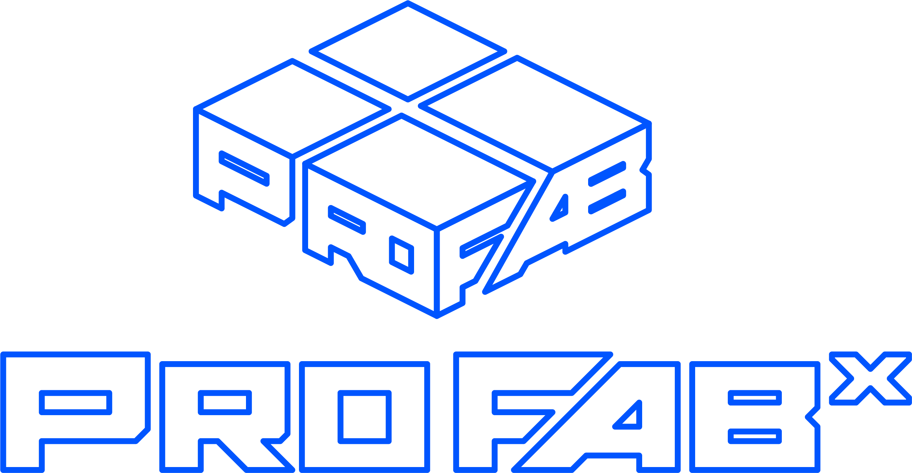

	

ProFabX致力于为硬件创新提供基础的能量，目前主要为以下业务
* Fab课程
  * [MIT Fab Lab](https://www.fablabs.io/)实验室认证和[Fab Academy](https://fabacademy.org/)课程指导；
  * [NexMaker-Fab课程](https://www.nexmaker.com/)：基于[MIT Fab Lab](https://www.fablabs.io/)的[Fab Academy](https://fabacademy.org/)课程，做了本地化延伸，从而适合大学生的基础跨界学习和企事业人员的硬件开发基础能力培养；
  * Fab实验室方案：给学校和企业在有限的空间内完成的实验室搭建，便于系统性学习硬件开发相关知识点，并且高效进行硬件设计、开发、调试相关工作；
  * AGV入门方案：基于AGV相关开发经验做出的教程，理论结合实际学习 Apollo算法，车载CAN,车载传感器和检测。为后续AGV无人车开发或者新能源车维修做基础；
* 原型开发服务：在结构开发、生成过程中，给客户提供生产的的优化建议、加工和配套后处理。目前主要针对于塑料、金属相关的3D打印（SLA、MJF,SLM），CNC加工、硅胶覆膜。
* 沙盘开发：基于原型开发相关的制造业基础和电控相关经验，给客户提供数字化交互沙盘

## 关于[Bob](bobwu@profabx.com)
一个不安分的maker，做过电动车研发，做过3D打印，做过创客空间，做过老师，搬过砖，学过Fab Academy。现在和小伙伴一起做些硬件相关的服务。
